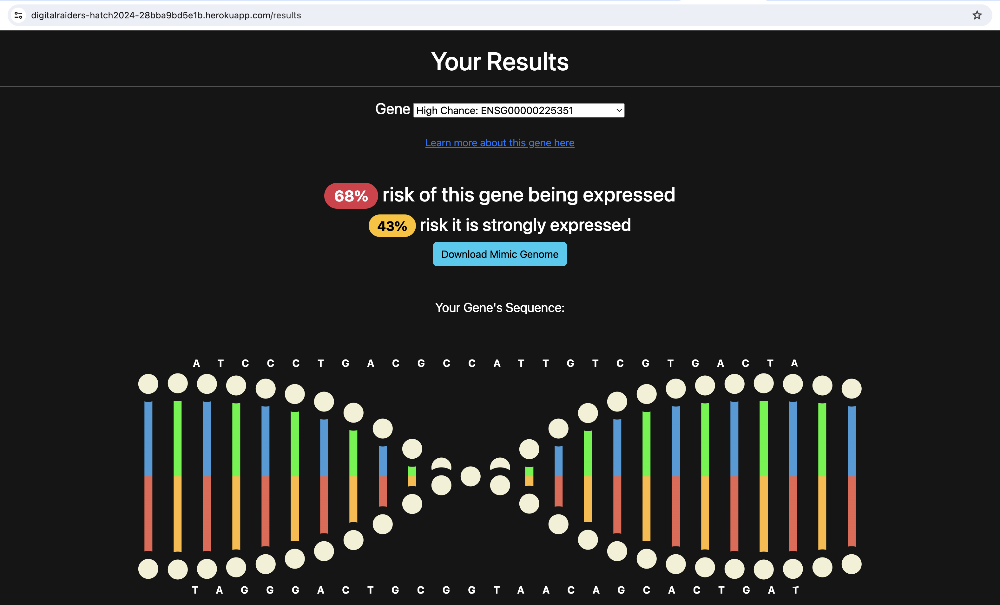

# MimicSequence
This is an app created for [HATCH 2024](https://hudsonalpha.org/techchallenge/).
You can view the app [here](https://digitalraiders-hatch2024-28bba9bd5e1b.herokuapp.com/).

## Inspiration

We selected this challenge because we wanted to learn about AI and Machine Learning. The idea that AI can help protect our data, and also allow us to do new kinds of research is revolutionary.

## What it does

MimicSequence compares a user's basic demographic information (age, gender, race, etc) to a database of mimicked genomes in order to determine the user's risk of developing lung cancer. The user can view this assessment, or download the mimic genomes that fit their profile. In this way, they can use the mimic data for services like 23andme instead of their own genetic data, but still have useful information. 

## How we built it

We started by building the frontend (the webapp) and the backend (the AI model) at the same time, and worked to get them to meet in the middle. The webapp design used HTML and CSS to display entry form and the genetic data visualization. On the backend, we got started on learning about the data, and training the AI model right away. Once we understood the format of the data, we attempted several different training models, including Tensorflow LSTM.

We finally decided to train the model on each gene one at a time. This gave us better results than training the model on an entire genome. We then used each gene model, combined with randomly generate demographic to produce 1000 mimic samples. The webapp reads from the mimic sample database, and select a subset of the samples that match well with the user's information.

## Challenges we ran into

It was difficult to train our model, and generate a mimic dataset. We started by trying to train the model on each entire sample genome, but that didn't work well. So instead we decided to train the model on each gene one at a time. This gave us better results than training the model on an entire genome.

Coming up with a story and name that fit the goals of the project was also challenging. Finding a name captures what the app makes possible proved difficult.

## Accomplishments that we're proud of

We proud of getting an AI model that we could use to generate a mimic dataset. It was the hardest part of the project by far. We're also proud of the DNA visualization on the results page and how much we learned about CSS in doing so.

## What we learned

We proud of learning a lot of AI and actually getting a model that we could use to generate a mimic dataset. 

We also learned a lot about how to do the presentation. 

## What's next for MimicSequence

We would first train the model with more data and more iterations. This would give even more accurate mimic datasets. We would also try to more accurately determine which genes are the most important for each user and their demographic.

